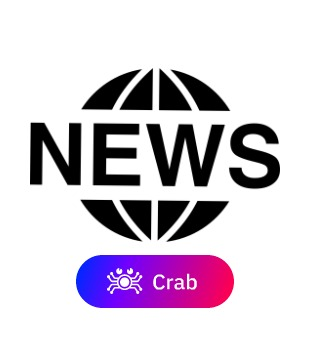
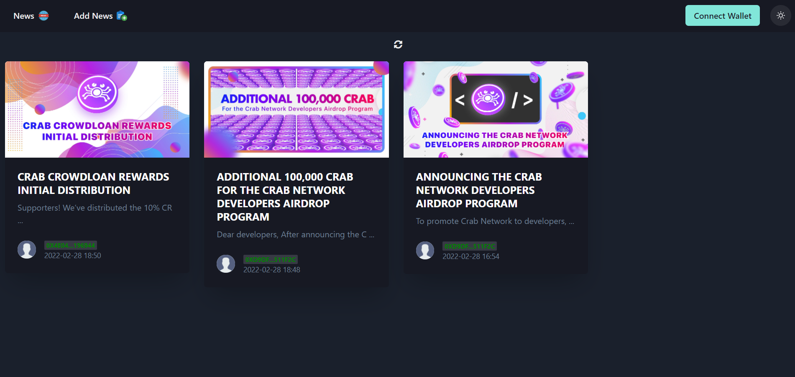
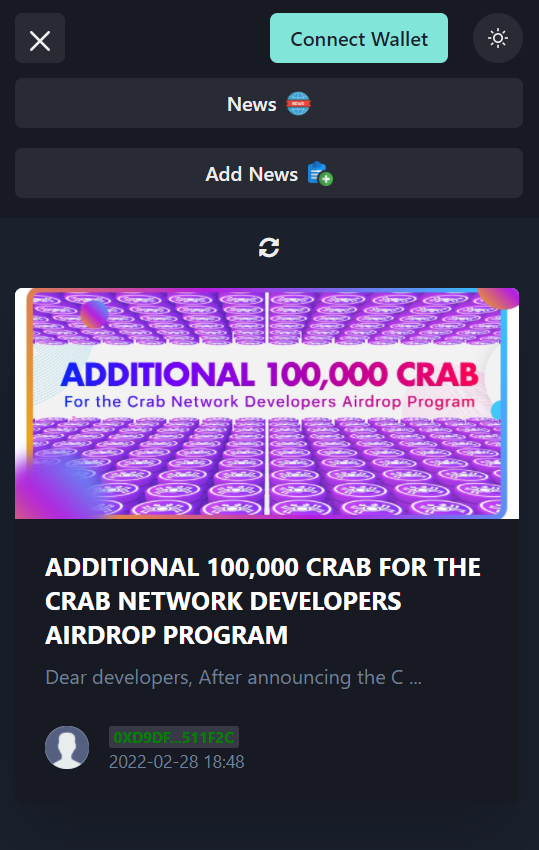

  

# Decentralized News Portal on Crab Network

Decentralized News Portal, that running on Crab Network, where everyone who has some news can share it by connecting their wallet to the portal and confirm the transaction.

----------

## Presentation

- **Video demo:** 
- **Live demo:** [https://crab-news-portal.netlify.app](https://crab-news-portal.netlify.app)

----------

## Features:

- Responsive design;
- Dark/Light Mode;
- Ability to see all the news posted (with the date & the address wallet of the author);
- Ability to add news on the portal;
- Possibility to upload multiple photos (using the button or drag and drop) in the article;
- Only the contract owner can delete the news;

----------

## Demo screens:

<table>
  <tr>
    <td></td>
    <td></td>
  </tr>
</table>

----------

## Deployment

Smart Contract deployed to [Crab Network](https://crab.network). App deployed on
Netlify and is available on [this site](https://crab-news-portal.netlify.app) but must have Metamask installed on your computer to interact with smart contract.

### Technology Stack and Tools

* [Metamask Wallet](https://metamask.io/)
* [React](https://reactjs.org/) - front end framework
* [Solidity](https://docs.soliditylang.org/en/v0.7.4/) - ethereum smart contract language
* [Web3](https://web3js.readthedocs.io/en/v1.3.0/) - library interact with ethereum nodes
* [JavaScript](https://www.javascript.com/) - logic front end and testing smart contracts
* [IPFS Infura](https://infura.io/) - connection to ethereum networks
* [Chacra ui](https://chakra-ui.com/) - UI component library

## Installation

Installing this project to use on your machine is simple. First,

`git clone https://github.com/mario-work/crab-news-portal.git`

the repository. Next, navigate to the cloned directory

`cd crab-news-portal`

and install the necessary Node.js modules with

`npm install`

Finally, to open the web app,

`npm run start`

You need to have Metamask Wallet. Connect to the app using your wallet. When connected, your address will show on the top navigation bar.

------------

Todos

- [ ] Adding categories and tags for news, as well as filtering news
- [ ] Add a more powerful text editor
- [ ] Add the ability to rate news
- [ ] Adding the ability to leave comments on news
- [ ] Adding a dashboard with functions for the admin
